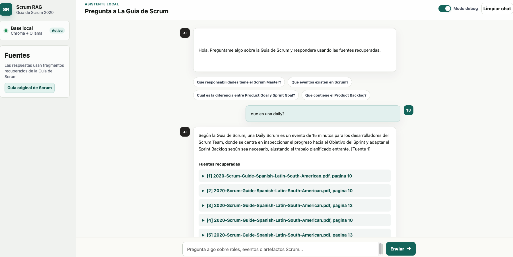

# scrum-guide-rag

Read this in Spanish: [README.es.md](README.es.md)

An educational project for building your first local RAG using the 2020 Scrum Guide.

This repository is designed for people who want to understand, through a small and practical example, how a Retrieval-Augmented Generation system works: loading documents, splitting them into chunks, creating embeddings, storing a vector index, retrieving relevant context, and chatting with a local model.



## What You Will Build

This project implements a local RAG over the Scrum Guide:

```text
PDF -> chunks -> embeddings -> Chroma -> question -> retrieval -> LLM -> answer
```

It includes:

- PDF, TXT, and Markdown document ingestion;
- chunking with LangChain;
- local embeddings with Ollama;
- local vector storage with Chroma;
- terminal chat;
- web chat interface;
- debug mode to inspect retrieved chunks;
- golden dataset for evaluation;
- basic retrieval, abstention, and answer coverage metrics.

## Why This Project

The Scrum Guide is a good first RAG use case because:

- it is a small document;
- it has well-defined concepts;
- it supports clear answerable questions;
- it also supports trick questions and out-of-document questions;
- it is easy to verify whether the model is hallucinating.

The goal is not just to "chat with a PDF". The goal is to learn the full RAG loop and have a base project you can reuse with your own documents.

## Stack

- Python
- LangChain
- Chroma
- Ollama
- `nomic-embed-text` for embeddings
- `llama3.2` for generation
- Vanilla HTML, CSS, and JavaScript for the frontend

## Project Structure

```text
scrum-guide-rag/
  data/                         # Source document
  eval/
    golden_dataset.jsonl         # Test questions
    reports/                     # Locally generated reports
  scrum_rag/
    config.py                    # Main configuration
    loaders.py                   # Document loading
    ingest.py                    # Indexing
    rag.py                       # RAG engine
    chat.py                      # Terminal chat
    search.py                    # Retrieval diagnostics
    evaluate.py                  # RAG evaluation
    web/
      app.py                     # ASGI web server
      static/                    # Frontend
  requirements.txt
  README.md
  README.es.md
```

## Requirements

You need Python 3.9+, Ollama, and Git.

Install Ollama:

https://ollama.com/download

Pull the models:

```bash
ollama pull llama3.2
ollama pull nomic-embed-text
```

## Installation

```bash
git clone https://github.com/lcdosguzman/scrum-guide-rag.git
cd scrum-guide-rag
python3 -m venv .venv
source .venv/bin/activate
pip install -r requirements.txt
```

## Usage

### 1. Index The Guide

```bash
python3 -m scrum_rag.ingest
```

This command reads documents from `data/`, splits text into chunks, generates embeddings with `nomic-embed-text`, and stores the index in `chroma_db/`.

Indexing deletes and rebuilds `chroma_db/` to avoid mixing old chunks with new ones.

### 2. Open The Web Chat

```bash
python3 -m uvicorn scrum_rag.web.app:app --host 127.0.0.1 --port 8000
```

Then open:

```text
http://127.0.0.1:8000
```

The web interface includes standard mode, debug mode, a reset chat button, and a link to the original Scrum Guide.

### 3. Terminal Chat

```bash
python3 -m scrum_rag.chat
```

Available commands:

- `/sources`: show sources for the last answer.
- `/exit`: quit.

### 4. Diagnose Retrieval

Before blaming the model, inspect what chunks the RAG retrieves:

```bash
python3 -m scrum_rag.search "oopsla"
```

This helps you understand whether a failure comes from retrieval or generation.

### 5. Evaluate The RAG

Evaluate retrieval only:

```bash
python3 -m scrum_rag.evaluate --retrieval-only
```

Evaluate the full pipeline:

```bash
python3 -m scrum_rag.evaluate
```

Reports are saved in `eval/reports/`.

The golden dataset lives in `eval/golden_dataset.jsonl`.

## What The Evaluation Measures

The project includes a simple local evaluation:

- `hit_rate`: whether expected evidence was found.
- `precision_at_k`: proportion of retrieved chunks that were relevant.
- `mrr`: how high the first relevant piece of evidence appears.
- `answer_term_coverage`: coverage of expected terms in generated answers.
- `abstention_accuracy`: whether the RAG abstains when the guide does not contain the answer.
- average and p95 latency.

This turns the RAG into something measurable, not just something that "seems to answer well".

## Learning Ideas

Try changing:

- `CHUNK_SIZE`
- `CHUNK_OVERLAP`
- `RETRIEVAL_K`
- the prompt in `scrum_rag/rag.py`
- the generation model in Ollama
- the embedding model

After each change, run:

```bash
python3 -m scrum_rag.evaluate --retrieval-only
python3 -m scrum_rag.evaluate
```

That way you can see whether your change improved or degraded the system.

## Limitations

This project is intentionally simple:

- no authentication;
- no user database;
- no incremental ingestion;
- no advanced reranking;
- no RAGAS or DeepEval yet;
- not intended as a production-ready product.

It is a starting point for learning and experimentation.

## Next Steps

Possible improvements:

- add more documents;
- implement incremental ingestion;
- add reranking;
- test other local models;
- integrate RAGAS or DeepEval;
- store logs of real user questions;
- turn failed questions into new golden dataset cases;
- migrate the frontend to React if the project grows.
